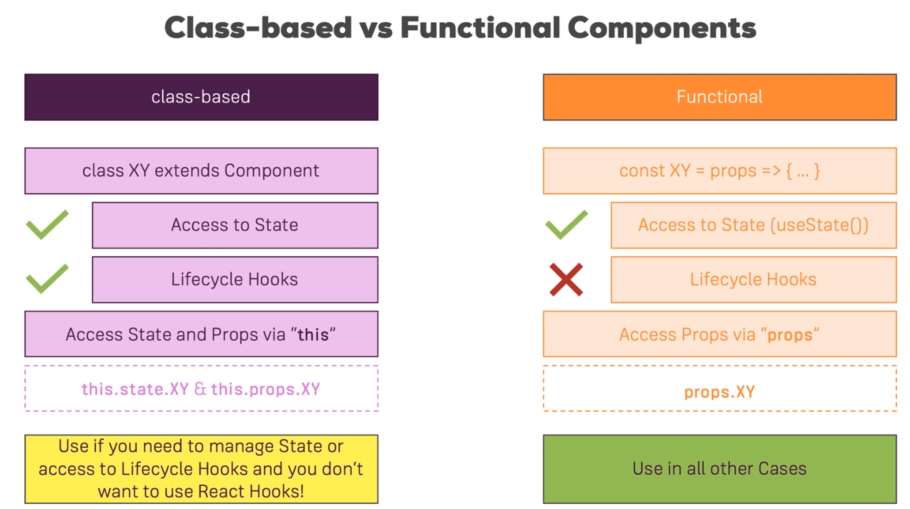

## Class-based vs Functional Components



## Component Lifecycle
Components Lifecycle with class based components
```js
constructor(props)                      //Call super(props) Do:Set up state Don't: Cause side effects
getDerivedStateFromProps(props,state)   //Do: Sync State Don't: Cause side effects
render()                                //Prepare & structure your JSX Code
  *Render Child Components*
componentDidMount()                     //Do: Cause Side-Effects Don't: Update State Synchronys (triggers re-render)

```
More Class-based Components
```js
getSnapshotBeforeUpdate()   
componentDidCatch()
componentWillUnmount()
shouldComponentUpdate()
componentDidUpdate()

```


